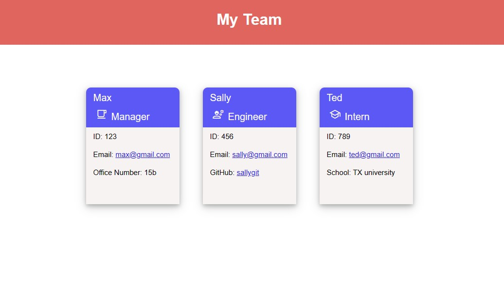

# Team Profile Generator

## User Story
* As a department manager I WANT a database to organize my employees information so I have access to their emails and GitHubs

## Description
This application will accept user input from the prompts provided and it will create an employee database.

## Technologies
* HTML 
* CSS 
* Javascript

## Installation
Clone the repository and install inquirer to run the program. Open the command-line and type "Node index.js" to start prompts. Answer the prompts and when you've completed answering the prompts a HTML document will generate with the inputed data.

## Usage
This application will be useful for department usage, to collect employee data.

## Credits
Alexandria Guerrero, https://github.com/Ag6793

## License

MIT License

Copyright (c) [2023] [Alexandria Guerrero]

Permission is hereby granted, free of charge, to any person obtaining a copy
of this software and associated documentation files (the "Software"), to deal
in the Software without restriction, including without limitation the rights
to use, copy, modify, merge, publish, distribute, sublicense, and/or sell
copies of the Software, and to permit persons to whom the Software is
furnished to do so, subject to the following conditions:

The above copyright notice and this permission notice shall be included in all
copies or substantial portions of the Software.

THE SOFTWARE IS PROVIDED "AS IS", WITHOUT WARRANTY OF ANY KIND, EXPRESS OR
IMPLIED, INCLUDING BUT NOT LIMITED TO THE WARRANTIES OF MERCHANTABILITY,
FITNESS FOR A PARTICULAR PURPOSE AND NONINFRINGEMENT. IN NO EVENT SHALL THE
AUTHORS OR COPYRIGHT HOLDERS BE LIABLE FOR ANY CLAIM, DAMAGES OR OTHER
LIABILITY, WHETHER IN AN ACTION OF CONTRACT, TORT OR OTHERWISE, ARISING FROM,
OUT OF OR IN CONNECTION WITH THE SOFTWARE OR THE USE OR OTHER DEALINGS IN THE
SOFTWARE.
